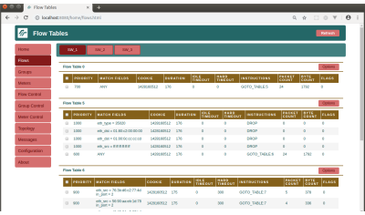
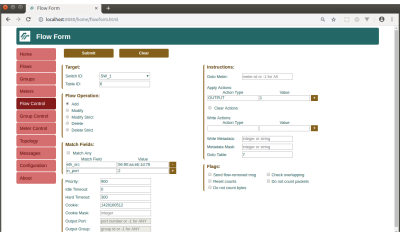
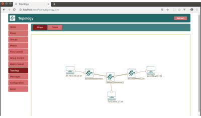

# FlowManager

The FlowManager is a RYU controller application that gives the user manual control over the flow tables in an OpenFlow network. The user can create, modify, or delete flows directly from the application. The user can also monitor the OpenFlow switches and view statistics. The FlowManager is ideal for learning OpenFlow in a lab environment, or in conjunction with other applications to tweak the behaviour of network flows in a test environment. 

## Features

- Add/modify/delete flow entries in flow tables.
- Add/modify/delete group tables and meters.
- Backup/restore switch tables to/from local drive.
- View flow tables, group tables, and meters.
- View switch statistics.
- View network topology.
- Track flow entries.

 
 

### New in V0.4.0

- Fixed a bug tracking flow entries.
- Editing Python code style closer to PEP-8 (more work is needed).
- Spliting Python code into four modules for easier management.
- Reorganized folders. 

## Dependencies

FlowManager is a [RYU Controller](https://osrg.github.io/ryu/) application, so make sure that the controller is installed properly before you proceed.
Also, if you intend to use FlowManager with [Mininet](http://mininet.org/), you will need to install that too.

## Installation

Install FlowManager using the following steps:

```
$ git clone https://github.com/martimy/flowmanager
```

## Running the app

Run the FlowManager alone:
```
$ ryu-manager ~/flowmanager/flowmanager.py
```

or with another RYU application:

```
$ ryu-manager ~/flowmanager/flowmanager.py ryu.app.simple_switch_13
```

and to display the topology:

```
$ ryu-manager --observe-links ~/flowmanager/flowmanager.py ryu.app.simple_switch_13
```

Use a web broswer to launch the site http://localhost:8080/home/index.html

### Docker installation

Use a [Docker image](https://hub.docker.com/r/martimy/ryu-flowmanager) to run Ryu Controller with the FlowManager.

```
docker pull martimy/ryu-flowmanager
docker run -d -p 6633:6633 -p 8080:8080 martimy/ryu-flowmanager
```

To run the controller with another Ryu app:

```
docker run -d -p 6633:6633 -p 8080:8080 martimy/ryu-flowmanager:latest ryu.app.simple_switch_13
docker run -d -p 6633:6633 -p 8080:8080 martimy/ryu-flowmanager:latest flowmanager/flowmanager.py ryu.app.simple_switch_13
```

To bypass the entry point:

```
docker run -it --entrypoint bash martimy/ryu-flowmanager
```

## Documentation

You can find some useful documention in [here](https://martimy.github.io/flowmanager/), but it is still a work-in-progress.


## Built With

* [Python](https://www.python.org/) - A programming language ideal for SDN applications.
* [jQuery](https://jquery.com/) - A JavaScript library for event handling, animation.
* [D3.js](https://d3js.org/) - A JavaScript library for data visulization. 

## Authors

* **Maen Artimy** - [Profile](http://adhocnode.com)

## License

FlowManager is licensed under the Apache 2 License - see the [LICENSE](LICENSE) file for details

