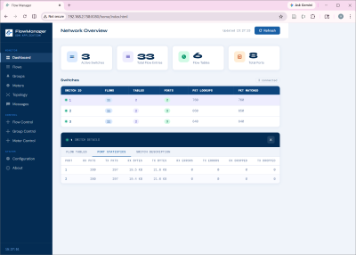
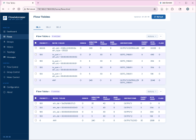
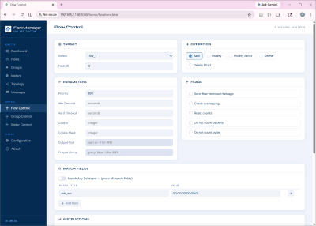
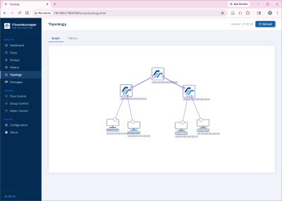

# FlowManager

[](https://codespaces.new/martimy/flowmanager?quickstart=1)
[](https://martimy.github.io/flowmanager)

FlowManager is a lightweight SDN application that provides direct, real-time control of OpenFlow switch tables. It is designed for teaching, experimentation, and rapid prototyping, allowing users to inspect, modify, and monitor flows in a controlled environment.

Originally built on Ryu, FlowManager (v0.5.0+) is now based on OS-Ken, improving maintainability and full Python 3 support.

## Quick Start

```bash
git clone https://github.com/martimy/flowmanager
cd flowmanager

python3 -m venv .venv
source .venv/bin/activate
pip install -r requirements.txt

python3 controller.py flowmanager.py
```

Open in browser:

```
http://localhost:8080/home/index.html
```

## Features

### Flow Management

- Add, modify, and delete flow entries
- Track flow changes over time

### Advanced Tables

- Manage group tables and meters
- Backup and restore switch state

### Monitoring & Visibility

- View flow, group, and meter tables
- Monitor switch statistics
- Visualize network topology


## Screenshots

[](docs/img/Screenshot_dash.png)
[](docs/img/Screenshot_flows.png)
[](docs/img/Screenshot_ctrl.png)
[](docs/img/Screenshot_topo.png)


## Architecture

- Controller: OS-Ken (OpenFlow control plane)
- Backend API: FastAPI
- Validation: Pydantic
- Frontend: Vue.js (v2)


## What’s New

### v0.5.0

* Migrated from Ryu to OS-Ken
* Replaced WSGI/RPC with FastAPI
* Introduced Pydantic models for validation and type safety
* Structured JSON API responses
* Modernized UI (Vue 2)
* Removed Python 2 compatibility layers

### v0.4.x

* jQuery upgrades and stability improvements
* Codebase refactoring and modularization

## Installation

Clone the repository:

```bash
git clone https://github.com/martimy/flowmanager
cd flowmanager
```

Set up environment:

```bash
python3 -m venv .venv
source .venv/bin/activate
pip install -r requirements.txt
```

## Docker

Run without local setup:

```bash
docker run -d -p 6653:6653 -p 8080:8080 martimy/flowmanager
```

Then open:

```
http://localhost:8080/home/index.html
```

## Running the Application

Run FlowManager:

```bash
python3 controller.py flowmanager.py
```

With another SDN application:

```bash
python3 controller.py flowmanager.py <application>
```

Enable topology discovery:

```bash
python3 controller.py --observe-links flowmanager.py <application>
```

Legacy UI:

```
http://host:8080/home/legacy/index.html
```

## Typical Workflow

1. Start FlowManager controller
2. Launch a Mininet topology
3. Open the web UI
4. Inspect flows and topology
5. Modify flows and observe behaviour


## Mininet

To use FlowManager with Mininet, install Mininet separately:
[http://mininet.org/](http://mininet.org/)

Example:

```bash
# Terminal 1
python3 controller.py flowmanager.py examples/learning_switch_2.py

# Terminal 2
sudo examples/mn_threeswitch_topo.py
```

## Examples (Docker compose)

You can start FlowManager + Mininet using Docker compose:

```bash
docker compose up -d
docker compose exec mininet ./mn_threeswitch_topo.py
```

and to shutdown:

```bash
docker down
```

*Note: The SDN apps and Mininet topologies are expected to be in the `examples` folder.*


## Run the Full SDN Lab in the Cloud (No Installation)

1. Click the button above — GitHub opens a complete environment in your browser.
2. Wait ~30–60 seconds (images are pulled the first time only).
3. In the terminal start controller + FlowManager:
   ```bash
   docker run -d -p 6653:6653 -p 8080:8080 /
         -v ${PWD}/examples:/home/auser/app --name flowmanager /
         martimy/flowmanager app/learning_switch_2.py
   ```
4. Start topology (Mininet):
   ```bash
   ./examples/mn_threeswitch_topo.py
   ```
5. Direct your browser to the link provided by the codespaces: `<link>/home/` 


## Documentation

Full documentation:
[https://martimy.github.io/flowmanager/](https://martimy.github.io/flowmanager/)

## Migrating Ryu Applications

Most Ryu applications can be migrated by updating imports:

Form

```python
from ryu.base import app_manager
```

To

```python
from os_ken.base import app_manager
```

Some API differences may exist. Test and validate behavior after migration.


## Using Older Versions

To use the pre-0.5 version:

```bash
git checkout legacy
```


## Use Cases

- SDN / OpenFlow teaching labs
- Network experimentation
- Debugging OpenFlow behavior
- Rapid prototyping of flow rules


## Author

**Maen Artimy**
[http://adhocnode.com](http://adhocnode.com)


## License

Licensed under the Apache 2.0 License. See [LICENSE](LICENSE).
