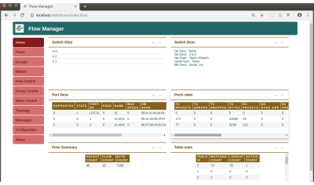
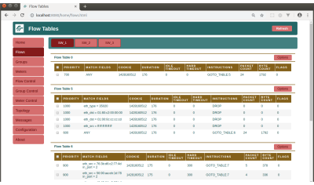
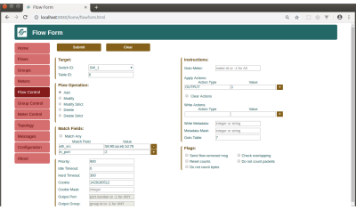
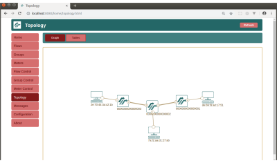

# FlowManager

[](https://martimy.github.io/flowmanager)


The FlowManager is an OS-Ken (formerly RYU) controller application that gives the user manual control over the flow tables in an OpenFlow network. The user can create, modify, or delete flows directly from the application. The user can also monitor the OpenFlow switches and view statistics. The FlowManager is ideal for learning OpenFlow in a lab environment, or in conjunction with other applications to tweak the behaviour of network flows in a test environment. 

## Features

- Add/modify/delete flow entries in flow tables.
- Add/modify/delete group tables and meters.
- Backup/restore switch tables to/from local drive.
- View flow tables, group tables, and meters.
- View switch statistics.
- View network topology.
- Track flow entries.

 
 

### New in V0.5.0

- Migrated from Ryu to OS-Ken for better maintenance and Python 3 compatibility.

### New in V0.4.2

- Upgraded jquery to v3.7.1

### New in V0.4.1

- Upgraded jquery to v3.5.0

### New in V0.4.0

- Fixed a bug tracking flow entries.
- Editing Python code style closer to PEP-8 (more work is needed).
- Spliting Python code into four modules for easier management.
- Reorganized folders. 

## Installation

### OS-Ken Controller

FlowManager is an [OS-Ken Controller](https://github.com/osrg/os-ken) application, so make sure that the controller is installed properly before you proceed. OS-Ken is a maintained fork of the Ryu SDN Framework.
Also, if you intend to use FlowManager with [Mininet](http://mininet.org/), you will need to install that too.

To install OS-Ken on Ubuntu/Debian:

```bash
$ sudo apt install python3-os-ken
```
(This will install version 2.3.1)

Alternatively, using pip:
```bash
$ pip install os-ken==3.1.1
```

### FlowManager

Install FlowManager using the following steps:

```bash
$ git clone https://github.com/martimy/flowmanager
```

## Running the app

To avoid `eventlet` related issues (like the "RLock was not greened" error), use the provided `run_osken.py` script to launch the application:

Run the FlowManager alone:
```bash
$ python3 run_osken.py flowmanager.py
```

or with another OS-Ken application:

```bash
$ python3 run_osken.py flowmanager.py \<application>\
```

and to display the topology:

```bash
$ python3 run_osken.py --observe-links flowmanager.py \<application\>
```

Use a web broswer to launch the site http://localhost:8080/home/index.html


## Documentation

You can find some useful documention in [here](https://martimy.github.io/flowmanager/), but it is still a work-in-progress.


## Built With

* [Python](https://www.python.org/) - A programming language ideal for SDN applications.
* [jQuery](https://jquery.com/) - A JavaScript library for event handling, animation.
* [D3.js](https://d3js.org/) - A JavaScript library for data visulization. 

## Authors

* Created by **Maen Artimy** - [Personal blog](http://adhocnode.com)

## License

FlowManager is licensed under the Apache 2 License - see the [LICENSE](LICENSE) file for details


