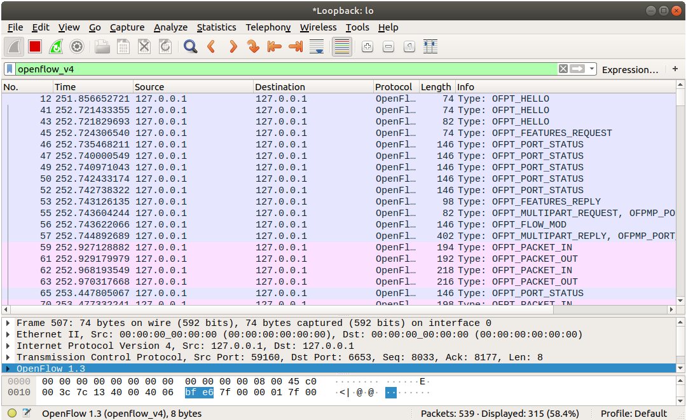

# Creating an SDN testbed
***Based on [RYU SDN Testbed Manual Version 1.6](http://www.obriain.com/training/sdn/RYU_Soft_Testbed_v1.6_odt.pdf) by Diarmuid O Briain*** 

(A newer version of the O Briain's Manual is [available here](http://www.obriain.com/training/sdn/RYU_Soft_Testbed_v2.0.pdf))

Here is how you can create an SDN testbed using Mininet, Ryu controller, and FlowManager in a Linux (Ubuntu 18.04) machine.

## Install Tools and Prerequisites
```
ryu@ryu-mn:~$ sudo apt-get install -y build-essential python-dev mtr tcpdump lynx iperf tshark fping wireshark net-tools curl python-pip python-eventlet python-routes python-webob python-paramiko openvswitch-switch git python3-pip
```

```
---> Configuring wireshark-common
    ---> Should non-superusers be able to capture packets? <Yes>
```

```
ryu@ryu-mn:~$ sudo chgrp wireshark /usr/bin/dumpcap
ryu@ryu-mn:~$ sudo chmod 4711 /usr/bin/dumpcap
ryu@ryu-mn:~$ sudo setcap cap_net_admin,cap_net_raw=eip /usr/bin/dumpcap
```

## Install Mininet
```
ryu@ryu-mn:~$ git -C /home/ryu/ clone git://github.com/mininet/mininet
ryu@ryu-mn:~$ sudo /home/ryu/mininet/util/install.sh -n
```

## Install Ryu

```
ryu@ryu-mn:~$ sudo apt-get install python3-ryu
```

## Install FlowManager
```
ryu@ryu-mn:~$ git clone https://github.com/martimy/ ~/flowmanager
```

## Test your testbed
```
ryu@ryu-mn:~$ ryu-manager ryu.app.simple_switch_13

loading app ryu.app.simple_switch_13
loading app ryu.controller.ofp_handler
instantiating app ryu.app.simple_switch_13 of SimpleSwitch13
instantiating app ryu.controller.ofp_handler of OFPHandler
```

In a different terminal run mininet
```
ryu@ryu-mn:~$ sudo mn --controller remote,ip=127.0.0.1  --switch ovsk,protocols=OpenFlow13 --mac --ipbase=10.1.1.0/24 --topo single,4
```

In another terminal review the OvS within mininet
```
ryu@ryu-mn:~$ sudo ovs-vsctl show
db733a9e-588e-4a7c-9010-e888ffabb244
    Bridge "s1"
        Controller "tcp:127.0.0.1:6653"
            is_connected: true
        Controller "ptcp:6654"
        fail_mode: secure
        Port "s1-eth2"
            Interface "s1-eth2"
        Port "s1"
            Interface "s1"
                type: internal
        Port "s1-eth4"
            Interface "s1-eth4"
        Port "s1-eth1"
            Interface "s1-eth1"
        Port "s1-eth3"
            Interface "s1-eth3"
    ovs_version: "2.9.0"
```

```
ryu@ryu-mn:~$ sudo ovs-ofctl -O OpenFlow13 dump-flows s1
 cookie=0x0, duration=153.609s, table=0, n_packets=34, n_bytes=2596, priority=0 actions=CONTROLLER:65535
```

In the terminal with the mininet shell
```
mininet> pingall
*** Ping: testing ping reachability
h1 -> h2 h3 h4
h2 -> h1 h3 h4
h3 -> h1 h2 h4
h4 -> h1 h2 h3
*** Results: 0% dropped (12/12 received)
```

Now re-review the flowtable in the OvS
```
ryu@ryu-mn:~$ sudo ovs-ofctl --protocols OpenFlow13 dump-flows s1
 cookie=0x0, duration=23.971s, table=0, n_packets=3, n_bytes=238, priority=1,in_port="s1-eth2",dl_src=00:00:00:00:00:02,dl_dst=00:00:00:00:00:01 actions=output:"s1-eth1"
 cookie=0x0, duration=23.967s, table=0, n_packets=2, n_bytes=140, priority=1,in_port="s1-eth1",dl_src=00:00:00:00:00:01,dl_dst=00:00:00:00:00:02 actions=output:"s1-eth2"
 cookie=0x0, duration=23.947s, table=0, n_packets=3, n_bytes=238, priority=1,in_port="s1-eth3",dl_src=00:00:00:00:00:03,dl_dst=00:00:00:00:00:01 actions=output:"s1-eth1"
 cookie=0x0, duration=23.941s, table=0, n_packets=2, n_bytes=140, priority=1,in_port="s1-eth1",dl_src=00:00:00:00:00:01,dl_dst=00:00:00:00:00:03 actions=output:"s1-eth3"
 cookie=0x0, duration=23.930s, table=0, n_packets=3, n_bytes=238, priority=1,in_port="s1-eth4",dl_src=00:00:00:00:00:04,dl_dst=00:00:00:00:00:01 actions=output:"s1-eth1"
 cookie=0x0, duration=23.915s, table=0, n_packets=2, n_bytes=140, priority=1,in_port="s1-eth1",dl_src=00:00:00:00:00:01,dl_dst=00:00:00:00:00:04 actions=output:"s1-eth4"
 cookie=0x0, duration=23.904s, table=0, n_packets=3, n_bytes=238, priority=1,in_port="s1-eth3",dl_src=00:00:00:00:00:03,dl_dst=00:00:00:00:00:02 actions=output:"s1-eth2"
 cookie=0x0, duration=23.887s, table=0, n_packets=2, n_bytes=140, priority=1,in_port="s1-eth2",dl_src=00:00:00:00:00:02,dl_dst=00:00:00:00:00:03 actions=output:"s1-eth3"
 cookie=0x0, duration=23.866s, table=0, n_packets=3, n_bytes=238, priority=1,in_port="s1-eth4",dl_src=00:00:00:00:00:04,dl_dst=00:00:00:00:00:02 actions=output:"s1-eth2"
 cookie=0x0, duration=23.865s, table=0, n_packets=2, n_bytes=140, priority=1,in_port="s1-eth2",dl_src=00:00:00:00:00:02,dl_dst=00:00:00:00:00:04 actions=output:"s1-eth4"
 cookie=0x0, duration=23.838s, table=0, n_packets=3, n_bytes=238, priority=1,in_port="s1-eth4",dl_src=00:00:00:00:00:04,dl_dst=00:00:00:00:00:03 actions=output:"s1-eth3"
 cookie=0x0, duration=23.835s, table=0, n_packets=2, n_bytes=140, priority=1,in_port="s1-eth3",dl_src=00:00:00:00:00:03,dl_dst=00:00:00:00:00:04 actions=output:"s1-eth4"
 cookie=0x0, duration=251.449s, table=0, n_packets=56, n_bytes=3968, priority=0 actions=CONTROLLER:65535
```

If you have wireshark running pointed to 127.0.0.1 you should see something like this



Now quit mininet and cleanup

```
mininet> quit
*** Stopping 1 controllers
c0
*** Stopping 6 terms
*** Stopping 4 links
....
*** Stopping 1 switches
s1
*** Stopping 4 hosts
h1 h2 h3 h4
*** Done
completed in 6.658 seconds
```

```
ryu@ryu-mn:~$ sudo mn --clean
*** Removing excess controllers/ofprotocols/ofdatapaths/pings/noxes
killall controller ofprotocol ofdatapath ping nox_corelt-nox_core ovs-openflowd ovs-controllerovs-testcontroller udpbwtest mnexec ivs ryu-manager 2> /dev/null
killall -9 controller ofprotocol ofdatapath ping nox_corelt-nox_core ovs-openflowd ovs-controllerovs-testcontroller udpbwtest mnexec ivs ryu-manager 2> /dev/null
pkill -9 -f "sudo mnexec"
*** Removing junk from /tmp
rm -f /tmp/vconn* /tmp/vlogs* /tmp/*.out /tmp/*.log
*** Removing old X11 tunnels
*** Removing excess kernel datapaths
ps ax | egrep -o 'dp[0-9]+' | sed 's/dp/nl:/'
***  Removing OVS datapaths
ovs-vsctl --timeout=1 list-br
ovs-vsctl --timeout=1 list-br
*** Removing all links of the pattern foo-ethX
ip link show | egrep -o '([-_.[:alnum:]]+-eth[[:digit:]]+)'
ip link show
*** Killing stale mininet node processes
pkill -9 -f mininet:
*** Shutting down stale tunnels
pkill -9 -f Tunnel=Ethernet
pkill -9 -f .ssh/mn
rm -f ~/.ssh/mn/*
*** Cleanup complete.
```

Your testbed is operational.
